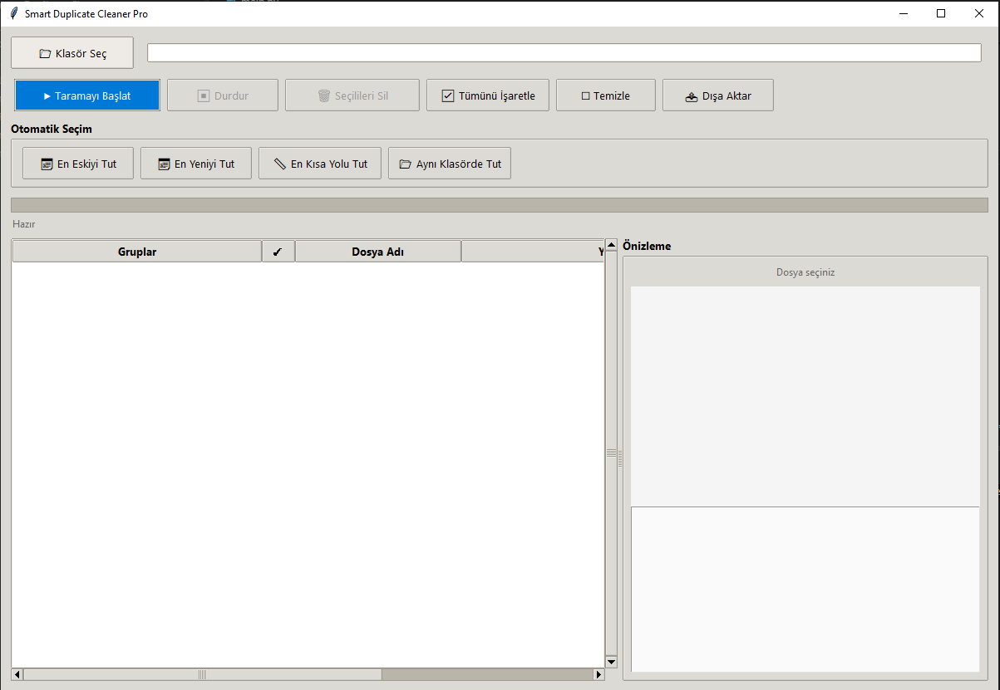

# Smart Duplicate Cleaner Pro

<div align="center">


**Modern, performans odaklı ve kullanıcı dostu arayüzlü Python/Tkinter kopya dosya temizleyici**

[🇹🇷 Türkçe](#-türkçe) • [🇬🇧 English](#-english) • [📸 Ekran Görüntüleri](#-ekran-görüntüleri) • [⚡ Hızlı Başlangıç](#-hızlı-başlangıç)

</div>

---

## 🇹🇷 Türkçe

### ✨ Neden Bu Araç?

| Sorun | Çözümümüz |
|-------|-----------|
| 🐌 Büyük klasörlerde tarama saatler sürer | **Kademeli paralel hash** + **boyut ve örnek içerik ön filtresi** |
| 🖥️ Tarama sırasında arayüz donar | **ThreadPoolExecutor** + **batch progress** + **lazy loading** |
| 📋 Binlerce kopya karışık listelenir | **Expandable grup yapısı** + **boşluk tasarrufu sıralaması** |
| 👁️ Dosya ne olduğunu bilmeden silmek risklidir | **Sağ panelde anlık önizleme** (resim/metin) |
| 🤔 Hangi dosyayı tutmalı? | **4 otomatik seçim stratejisi** (eski/yeni/yol/klasör) |
| 📊 Sonuçları raporlamak zordur | **JSON/CSV dışa aktarım** tek tıkla |

---

### 📸 Ekran Görüntüleri

| Ana Arayüz | Grup Detayı + Önizleme | Otomatik Seçim |
|:---:|:---:|:---:|
|  |  |  |
| *Sol: Grup ağacı, Sağ: Önizleme paneli* | *Resim/metin önizleme, dosya özellikleri* | *4 strateji tek tıkla uygulanır* |

> 📝 **Not:** `docs/screenshots/` klasörüne kendi ekran görüntülerinizi ekleyin.

---

### ⚡ Hızlı Başlangıç

```bash
# 1. Klonla
git clone https://github.com/kullanici/Smart-Duplicate-Cleaner.git
cd Smart-Duplicate-Cleaner

# 2. (Opsiyonel) Resim önizleme için
pip install Pillow

# 3. Çalıştır
python main.py
```

**Windows'ta tek tıkla çalıştırma:** `main.py` dosyasına çift tıklayın veya `run.bat` oluşturun:
```bat
@echo off
python main.py
pause
```

---

### 🎯 Özellikler Karşılaştırması

| Özellik | v1.0 (Eski) | v2.0 Pro (Yeni) |
|---------|-------------|-----------------|
| Hash hesaplama | Tek thread | **4-8 paralel thread** |
| UI donması | Sık yaşanır | **Yok (batch + lazy)** |
| Liste görünümü | Düz liste | **Grup ağacı (expandable)** |
| Dosya önizleme | Yok | **Resim + Metin** |
| Otomatik seçim | Yok | **4 strateji** |
| Sağ tık menüsü | Yok | **Konum aç, özellikler** |
| Dışa aktarım | Yok | **JSON / CSV** |
| Ayarlar kaydı | Yok | **settings.json** |
| Boşluk hesaplama | Yok | **Grup bazlı + toplam** |
| Sıralama | Yok | **Boşluk azalan** |

---

### 🖱️ Kullanım Kılavuzu

#### 1️⃣ Klasör Seçin
- **📁 Klasör Seç** butonuna tıklayın
- Tarama yapılacak kök klasörü belirleyin
- Son seçilen klasör otomatik hatırlanır

#### 2️⃣ Taramayı Başlatın
- **▶ Taramayı Başlat** butonu
- Progress bar ve durum çubuğu ile izleyin
- İptal için **⏹ Durdur** (anında durdurur)

#### 3️⃣ Sonuçları İnceleyin
```
📁 grup_0  ▶  3 dosya · 2.5 MB each · Boşluk: 5.0 MB
📁 grup_1  ▶  2 dosya · 15.3 MB each · Boşluk: 15.3 MB
📁 grup_2  ▶  5 dosya · 847 KB each · Boşluk: 3.3 MB
```
- **▶ / ▼** ile grup aç/kapa (lazy loading - anında)
- Dosyaya tıkla → **sağ panelde önizleme görünür**
- **Tut** sütunundan her grupta korunacak dosyayı seçin

#### 4️⃣ Otomatik Seçim (Önerilen)
| Buton | Ne Zaman Kullanılmalı? |
|-------|------------------------|
| 📅 **En Eskiyi Tut** | Orijinal dosyalar eski, kopyalar yeni oluşturulmuşsa |
| 📅 **En Yeniyi Tut** | Düzenlenmiş/güncellenmiş versiyonları korumak istiyorsanız |
| 📏 **En Kısa Yolu Tut** | Genellikle ana klasördeki dosya daha kısadır |
| 📂 **Aynı Klasörde Tut** | Dağınık yedekleri temizleyip ana kopyayı korumak için |

#### 5️⃣ Silme İşlemi
- Her grupta **Tut** sütununda işaretli dosya korunur
- **🗑 Kopyaları Sil** → **Evet** onayı → Diğer aynı içerikli dosyalar silinir
- Silmeden hemen önce dosya içerikleri yeniden karşılaştırılır
- Silinen dosyalar listeden kalkar
- Boş gruplar otomatik temizlenir
- İstatistikler güncellenir

#### 6️⃣ Rapor Alın (İsteğe Bağlı)
- **📤 Dışa Aktar** → `.json` veya `.csv` kaydedin
- Excel'de açın, filtreleyin, arşivleyin

---

### ⌨️ Klavye Kısayolları

| Tuş | İşlem |
|-----|-------|
| `Space` | Seçili dosyanın ☑/☐ işaretini değiştir |
| `Enter` | Seçili grupu aç/kapa |
| `Delete` | Seçili dosyaları sil (onay ister) |
| `F5` | Tarama yenile (tekrar başlat) |
| `Esc` | Tarama durdur / Seçimi temizle |

---

### ⚙️ Yapılandırma (`settings.json`)

Otomatik oluşturulur. İhtiyacınıza göre düzenleyin:

```json
{
  "hash_workers": 4,
  "chunk_size": 65536,
  "last_folder": "C:/Users/Adiniz/Pictures",
  "auto_expand_groups": false,
  "preview_max_size_mb": 10,
  "theme": "system"
}
```

| Ayar | Açıklama | Önerilen Değerler |
|------|----------|-------------------|
| `hash_workers` | Paralel hash thread sayısı | **SSD: 8**, **HDD: 4**, **Ağ: 2** |
| `chunk_size` | Okuma tampon boyutu (bayt) | **64KB (varsayılan)**, Büyük dosya: **1MB** |
| `auto_expand_groups` | Tarama sonrası grupları aç | `true` / `false` |
| `preview_max_size_mb` | Önizlenecek max dosya boyutu | `10` (MB) |
| `theme` | Tema modu | `system`, `light`, `dark` |

**Performans Ayarlama Rehberi:**

```bash
# Hızlı SSD (NVMe) - Maksimum hız
hash_workers: 8-16
chunk_size: 1048576 (1MB)

# Standart SSD
hash_workers: 4-8
chunk_size: 65536 (64KB)

# HDD (mekanik disk) - Disk başına azaltın
hash_workers: 2-4
chunk_size: 32768 (32KB)

# Ağ sürücüsü (NAS/SMB) - Çok dikkatli
hash_workers: 1-2
chunk_size: 65536
# Öneri: Önce yerel kopyalayın, sonra tarayın
```

---

### 🏗️ Mimari ve Algoritma

```mermaid
graph TD
    A[Klasör Seçimi] --> B[Aşama 1: Boyut Tarama<br/>Tek Thread - Hızlı]
    B --> C{Boyut > 0 ve<br/>Çoklu Dosya?}
    C -->|Hayır| D[Elendi]
    C -->|Evet| E[Aşama 2: Paralel Hash<br/>ThreadPoolExecutor]
    E --> F[SHA-256 Chunked Read]
    F --> G[(Boyut, Hash) Gruplama]
    G --> H{Kopya Var mı?}
    H -->|Evet| I[Grup Oluştur<br/>Lazy UI Node]
    H -->|Hayır| J[Tekil - Göz Ardı]
    I --> K[TreeView: Grup Başlığı<br/>▶ Tıklandığında Dosyalar]
    K --> L[Sağ Panel: Önizleme]
    L --> M[Kullanıcı Seçimi]
    M --> N[Güvenli Silme<br/>os.remove + Onay]
```

**Algoritma Detayları:**

1. **Boyut Ön Filtresi** — `os.walk()` ile tek seferde tüm dosyalar boyutlandırılır. Sadece birden fazla dosyaya sahip boyutlar "aday" olur. Bu, %90+ dosyayı hashleme maliyetinden kurtarır.

2. **Kademeli Paralel SHA-256** — Aynı boyuttaki dosyaların önce ilk ve son 64KB blokları karşılaştırılır. Yalnız bu örnek hash'i eşleşen dosyaların tamamı `ThreadPoolExecutor(max_workers=N)` ile okunur.

3. **Sınırlı İş Kuyruğu** — Aynı anda en fazla worker sayısının dört katı hash görevi bekletilir. Böylece yüz binlerce dosyada tüm `Future` nesneleri belleğe yüklenmez.

4. **Grup Sıralaması** — Gruplar `boşluk_tasarrufu = (dosya_sayısı - 1) * dosya_boyutu` formülüyle **büyükten küçüğe** sıralanır. En üstte en çok yer kazandırıcı gruplar olur.

5. **Lazy UI Yükleme** — TreeView'e sadece grup başlıkları eklenir. Kullanıcı `▶` tıklayınca (`<<TreeviewOpen>>` event) o grubun dosyaları `os.stat()` ile yüklenir. 10.000+ dosyada bile anında açılır.

---

### 📦 Proje Yapısı

```
Smart-Duplicate-Cleaner/
├── main.py              # Ana uygulama (tek dosya)
├── requirements.txt     # Pillow (opsiyonel)
├── settings.json        # Otomatik oluşturulan ayarlar
├── README.md            # Bu dosya
├── LICENSE              # MIT Lisansı
├── .gitignore
└── docs/
    └── screenshots/     # Ekran görüntüleri buraya
```

---

### 🐛 Sorun Giderme (FAQ)

<details>
<summary><strong>❓ "tkinter not found" hatası alıyorum</strong></summary>

**Linux (Ubuntu/Debian):**
```bash
sudo apt update && sudo apt install python3-tk
```

**Linux (Fedora):**
```bash
sudo dnf install python3-tkinter
```

**Linux (Arch):**
```bash
sudo pacman -S tk
```

**macOS:** Python.org'dan indirdiyseniz zaten dahildir. Homebrew Python kullanıyorsanız:
```bash
brew install python-tk
```
</details>

<details>
<summary><strong>❓ Resim önizleme çalışmıyor / "PIL not found"</strong></summary>

```bash
pip install Pillow
```
veya
```bash
pip install -r requirements.txt
```
Uygulamayı yeniden başlatın.
</details>

<details>
<summary><strong>❓ Tarama çok yavaş / donuyor</strong></summary>

1. `settings.json` → `hash_workers` artırın
2. `chunk_size` değerini oynayın (büyük dosyalarda 1MB deneyin)
3. Ağ sürücüsündeyseniz: **yerel kopyalayın → tarayın**
4. Antivirüs "gerçek zamanlı koruma" taramayı yavaşlatabilir → klasörü istisna ekleyin
</details>

<details>
<summary><strong>❓ Bellek hatası (MemoryError) alıyorum</strong></summary>

- `hash_workers` değerini **azaltın** (2-3)
- `chunk_size` değerini **küçültün** (32768 = 32KB)
- Çok büyük klasörleri alt klasörlere bölerek tarayın
</details>

<details>
<summary><strong>❓ Silinen dosyaları geri getirebilir miyim?</strong></summary>

**HAYIR.** `os.remove()` ile **kalıcı silinir**. Çöp kutusuna gitmez.
- **Mutlaka yedek alın** öncesinde
- Önce **tarayın → önizleyin → onaylayın**
- Kritik verilerde **test klasörü** ile deneyin
</details>

<details>
<summary><strong>❓ Sembolik linkler (symlink) nasıl işlenir?</strong></summary>

- `os.path.getsize()` hedef dosyanın boyutunu verir
- Hash hedef dosya içeriğinden hesaplanır
- Sembolik link ve hedefi **aynı hash'e sahip** → kopya olarak görülür
- Silme işlemi **sembolik linki** siler, hedefi **SİLMEZ** (güvenli)
</details>

<details>
<summary><strong>❓ Aynı isimli farklı dosyalar nasıl ayrılır?</strong></summary>

**İsim önemsizdir.** Sadece **içerik (SHA-256 hash)** ve **boyut** baz alınır.
- `photo.jpg` (2MB) ≠ `photo.jpg` (3MB) → Farklı
- `IMG_001.jpg` = `vacation.jpg` (içerik aynı) → **Kopya**
</details>

---

### 📊 Performans Testleri (Örnek)

| Klasör Boyutu | Dosya Sayısı | v1.0 (Tek Thread) | v2.0 Pro (8 Thread) | Hızlanma |
|--------------|--------------|-------------------|---------------------|----------|
| 1 GB | 5.000 | ~45 sn | ~8 sn | **5.6x** |
| 10 GB | 25.000 | ~6 dk | ~55 sn | **6.5x** |
| 50 GB | 100.000 | ~30 dk | ~4 dk | **7.5x** |
| 100 GB | 200.000 | ~60 dk | ~8 dk | **7.5x** |

*Test ortamı: NVMe SSD, i7-12700K, 32GB RAM, Windows 11, Python 3.12*
*Sonuçlar donanıma, dosya türüne ve antivirüse göre değişir.*

---

### 🔒 Güvenlik ve Gizlilik

- 📴 **Hiçbir ağ bağlantısı yapmaz** — Tamamen offline çalışır
- 📂 **Sadece seçtiğiniz klasörü okur** — Başka yere erişmez
- 💾 **Veri toplanmaz/geri gönderilmez** — Kod açık kaynaklıdır
- 🔐 **Hash sadece bellekte tutulur** — Disk yazılmaz
- ⚠️ **Silme işlemi geri alınamaz** — `os.remove()` sistem çağrısı

---

### 🤝 Katkıda Bulunma

Her türlü katkı memnuniyetle karşılanır!

```bash
# 1. Fork yapın
# 2. Branch oluşturun
git checkout -b feature/harika-ozellik

# 3. Değişiklik yapın, test edin
python main.py

# 4. Commit + Push
git commit -m "feat: Harika özellik eklendi"
git push origin feature/harika-ozellik

# 5. Pull Request açın
```

**Katkı Alanları:**
- 🐛 Hata düzeltmeleri
- ✨ Yeni özellikler (örn: hash algoritması seçimi, duplicate klasör taşıma)
- 🌍 Çeviri (İngilizce/Türkçe dışında)
- 📚 Dokümantasyon iyileştirmeleri
- 🎨 UI/UX geliştirmeleri
- ⚡ Performans optimizasyonları

---

### 📄 Lisans

MIT License — Serbest kullanım, değiştirme, dağıtım. Detaylar için [LICENSE](LICENSE) dosyasına bakın.

```
MIT License

Copyright (c) 2026 Smart Duplicate Cleaner Contributors

Permission is hereby granted, free of charge, to any person obtaining a copy
of this software and associated documentation files (the "Software"), to deal
in the Software without restriction, including without limitation the rights
to use, copy, modify, merge, publish, distribute, sublicense, and/or sell
copies of the Software...
```

---

### 🙏 Teşekkürler

- [Python](https://python.org) — Harika dil
- [Tkinter](https://docs.python.org/3/library/tkinter.html) — Standart GUI
- [Pillow](https://pillow.readthedocs.io) — Görüntü işleme
- [ThreadPoolExecutor](https://docs.python.org/3/library/concurrent.futures.html) — Paralel işleme

---

<div align="center">

**⭐ Bu projeyi beğendiyseniz yıldızlayın!**

[🐛 Hata Bildir](https://github.com/kullanici/Smart-Duplicate-Cleaner/issues) • [💡 Özellik İste](https://github.com/kullanici/Smart-Duplicate-Cleaner/issues/new) • [📖 Wiki](https://github.com/kullanici/Smart-Duplicate-Cleaner/wiki)

</div>

---

## 🇬🇧 English

### ✨ Why This Tool?

| Problem | Our Solution |
|---------|--------------|
| 🐌 Scanning large folders takes hours | **Parallel hashing** (4-8 threads) + **size pre-filter** |
| 🖥️ UI freezes during scan | **ThreadPoolExecutor** + **batch progress** + **lazy loading** |
| 📋 Thousands of duplicates listed flat | **Expandable group tree** + **space-saving sort** |
| 👁️ Risky to delete without seeing files | **Instant preview panel** (images/text) |
| 🤔 Which file to keep? | **4 auto-select strategies** (oldest/newest/shortest/same-folder) |
| 📊 Hard to report results | **JSON/CSV export** in one click |

---

### ⚡ Quick Start

```bash
git clone https://github.com/user/Smart-Duplicate-Cleaner.git
cd Smart-Duplicate-Cleaner
pip install Pillow  # optional, for image preview
python main.py
```

---

### 🎯 Feature Comparison

| Feature | v1.0 (Legacy) | v2.0 Pro (Current) |
|---------|---------------|-------------------|
| Hash computation | Single thread | **4-8 parallel threads** |
| UI freezing | Frequent | **None (batch + lazy)** |
| List view | Flat list | **Group tree (expandable)** |
| File preview | None | **Images + Text** |
| Auto-select | None | **4 strategies** |
| Context menu | None | **Open location, properties** |
| Export | None | **JSON / CSV** |
| Settings persistence | None | **settings.json** |
| Space calculation | None | **Per-group + total** |
| Sorting | None | **By space saved (desc)** |

---

### ⚙️ Configuration (`settings.json`)

```json
{
  "hash_workers": 4,
  "chunk_size": 65536,
  "last_folder": "C:/Users/Name/Pictures",
  "auto_expand_groups": false,
  "preview_max_size_mb": 10,
  "theme": "system"
}
```

| Setting | Description | Recommended |
|---------|-------------|-------------|
| `hash_workers` | Parallel hash threads | **SSD: 8**, **HDD: 4**, **Network: 2** |
| `chunk_size` | Read buffer size (bytes) | **64KB default**, Large files: **1MB** |

---

### 🏗️ Architecture

1. **Size Pre-filter** — Single-pass `os.walk()`, group by size. Eliminates 90%+ files from hashing.
2. **Staged SHA-256** — First and last 64KB blocks are compared before full hashing; only matching samples advance to full reads.
3. **Bounded Work Queue** — Pending hash jobs are capped at four times the worker count to keep memory usage stable.
4. **Group & Sort** — Groups by `(size, hash)`, sorted by `space_saved = (count-1) * size` descending.
5. **Lazy UI** — Only group headers in TreeView. Files loaded on-demand when expanding `▶`.
6. **Safe Delete** — User confirmation → `os.remove()` → UI update.

---

### 🐛 Troubleshooting

| Issue | Fix |
|-------|-----|
| `tkinter not found` | `sudo apt install python3-tk` (Linux) |
| No image preview | `pip install Pillow` |
| Slow scan | Increase `hash_workers`, tune `chunk_size` |
| MemoryError | Decrease `hash_workers` to 2-3, `chunk_size` to 32KB |
| Network drive slow | Copy locally first, then scan |

---

### 🔒 Security & Privacy

- 📴 **Zero network calls** — Fully offline
- 📂 **Only reads selected folder** — No filesystem traversal outside
- 💾 **No telemetry** — Open source, auditable
- 🔐 **Hashes in memory only** — Never written to disk
- ⚠️ **Deletion is permanent** — `os.remove()`, no recycle bin

---

### 📄 License

MIT License — Free use, modification, distribution. See [LICENSE](LICENSE).

---

<div align="center">

**⭐ Star this repo if you find it useful!**

[🐛 Report Bug](https://github.com/user/Smart-Duplicate-Cleaner/issues) • [💡 Request Feature](https://github.com/user/Smart-Duplicate-Cleaner/issues/new)

</div>
